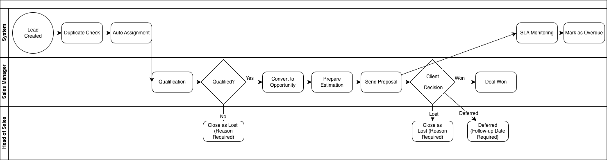
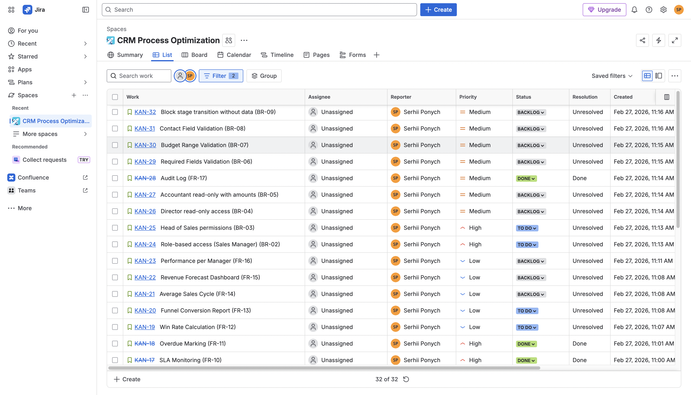
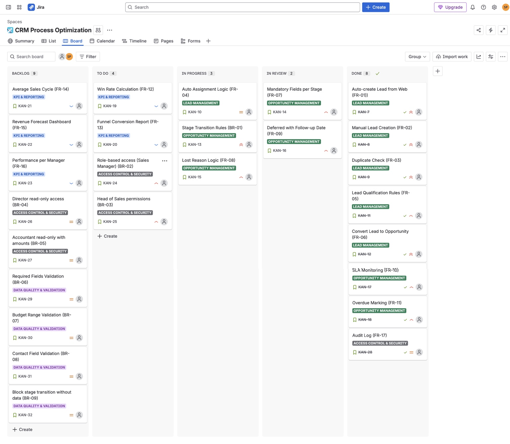
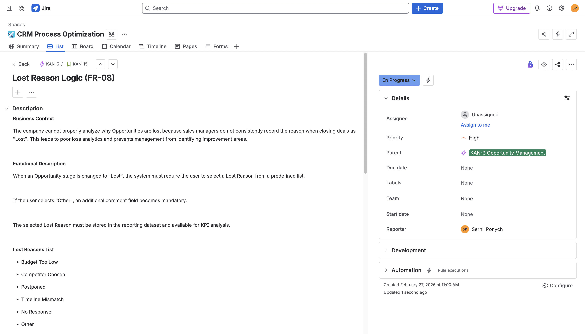
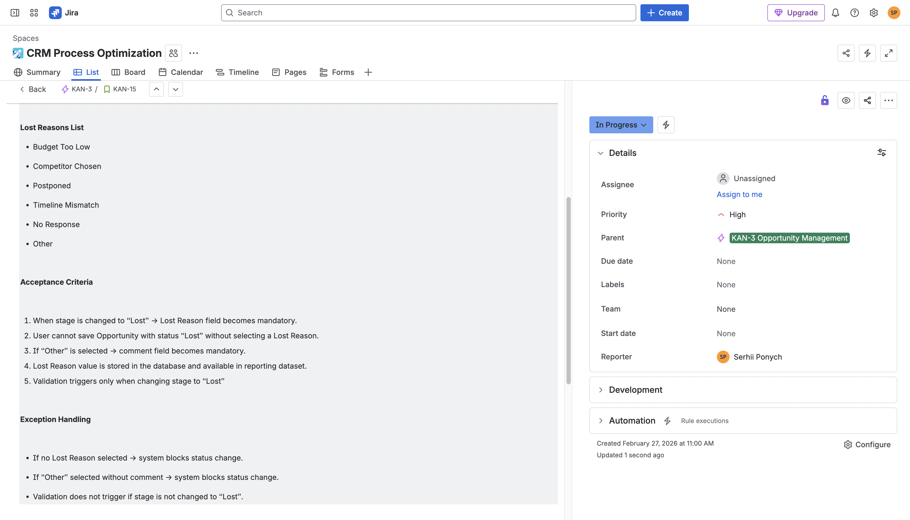

# CRM Sales Process Optimization  
### Business Analysis Case Study

CRM optimization project for a **Design & Renovation company** aimed at improving sales pipeline management, data quality, and revenue forecasting.

---

# Case Study Overview

This repository presents a **Business Analysis case study** focused on optimizing the sales process in a CRM system for a design and renovation company.

The project demonstrates a complete BA workflow:

- business problem analysis
- AS-IS / TO-BE process design
- business rules definition
- functional requirements
- CRM data model design
- KPI framework
- backlog management in Jira
- implementation roadmap

---

# Business Context

The company provides **turnkey interior design and renovation services**.

### Key characteristics

- 50–70 employees  
- mixed sales model: **inside + field sales**  
- client segments: **B2B and B2C**

### Sales cycle

Consultation → Estimation → Proposal → Contract

The CRM system is used by sales managers to track leads and opportunities.

---

# Problem Statement

The CRM system is used **formally** and does not provide operational control.

### Major issues

- lack of pipeline discipline
- poor data quality
- unclear lead ownership
- inconsistent follow-up
- no structured loss analysis

### Business consequences

- unreliable revenue forecast
- limited visibility into sales performance
- high risk of losing potential clients
- difficult scaling of the sales team

---

# Project Goal

Improve sales process governance by introducing:

- standardized **sales pipeline**
- **stage transition rules**
- **SLA monitoring**
- **KPI framework**
- **role-based access control**
- structured **reporting layer**

---

# Scope

## In Scope

- Lead & Opportunity pipeline redesign
- automatic lead distribution
- stage transition validation rules
- required fields enforcement
- lost reason tracking
- deferred follow-up logic
- SLA monitoring
- KPI dashboards
- role-based access control

## Out of Scope

- CRM platform replacement
- accounting processes
- production workflow
- design project management

---

# Stakeholders

### Primary

- Head of Sales
- Sales Managers

### Secondary

- Accountant
- Designer
- Foreman

### System Owner

Director

### Sponsor

Business Owner

---

# AS-IS Process

Before optimization the CRM workflow had several problems:

- manual lead creation
- duplicate records
- unclear ownership
- chaotic pipeline stages
- lack of follow-up discipline
- no SLA monitoring
- no structured loss analysis

This resulted in poor visibility into the sales pipeline.

---

# TO-BE Process

The optimized CRM process introduces automation and governance.

### Key improvements

- automatic lead creation from web channels
- duplicate detection
- automatic lead assignment
- required field validation
- stage transition rules
- SLA monitoring
- mandatory lost reasons
- deferred follow-up logic
- KPI reporting

### Process Diagram



---

# Sales Pipeline Structure

## Lead Stages

- New
- Contacted
- Budget Not Confirmed
- Qualified
- Lost

## Opportunity Stages

- Estimation in Progress
- Proposal Sent
- Deferred
- Won
- Lost

---

# Business Rules

Key governance rules implemented in CRM:

- **BR-01** Stage transition allowed only when required fields are filled  
- **BR-02** Lost stage requires selecting a reason  
- **BR-03** Lost reason *Other* requires comment  
- **BR-04** Deferred requires follow-up date  
- **BR-05** Ownership can be changed only by Head of Sales  
- **BR-06** SLA violation marks deal as **Overdue**

---

# Functional Requirements

Examples of system requirements:

- automatic lead creation from web channels
- duplicate detection by phone/email
- automatic ownership assignment
- lead → opportunity conversion
- required field validation
- lost reason validation
- deferred follow-up scheduling
- SLA monitoring
- revenue tracking
- audit logging of key changes

---

# Jira Backlog

User stories and backlog items were managed in **Jira**.

### Backlog



### Workflow Board



### Example User Story



---

# Data Model

The CRM data model supports lead qualification, opportunity management, task tracking, and loss analysis.

### Core Entities

- User
- Lead
- Opportunity
- Activity
- Task
- LostReason
- AuditLog

### ER Diagram


---

# KPI Framework

Key performance indicators used to monitor sales performance:

- Win Rate
- Conversion Rate by Stage
- Average Sales Cycle
- Overdue Deals
- Top Lost Reasons
- Performance per Manager
- Revenue Forecast

### KPI Definition


---

# Reporting Layer

Sales monitoring dashboards provide operational insights.

### Dashboards

- Sales Pipeline Dashboard
- Sales Performance Dashboard
- Loss Analysis Dashboard

### Reporting Design


---

# Role-Based Access Control

### Sales Manager
- sees only own deals
- cannot change ownership

### Head of Sales
- sees all deals
- can reassign ownership
- monitors KPIs and SLA

### Director
- read-only analytics

### Accountant
- read-only pipeline
- access to financial amounts

---

# Implementation Roadmap

The CRM optimization is implemented in multiple phases.

1. **Process Definition**
2. **CRM Configuration**
3. **Reporting Setup**
4. **Training & Rollout**
5. **Monitoring & Optimization**


---

# Expected Outcomes

The CRM optimization enables:

- improved conversion rates
- shorter sales cycle
- reduced lead loss
- transparent manager performance
- reliable revenue forecasting
- scalable sales operations

---

# Tools Used

**Documentation**

- Confluence

**Backlog Management**

- Jira

**Process Modeling**

- BPMN diagrams

**Data Modeling**

- ER diagrams

**Version Control**

- GitHub

---

# Repository Structure

```
crm-optimization-business-analysis

├── docs
│   ├── executive-summary.md
│   ├── requirements.md
│   ├── kpi.md
│   └── implementation-roadmap.md
│
├── confluence
│   ├── kpi-metrics.png
│   ├── process-to-be-1.png
│   ├── process-to-be-2.png
│   ├── process-to-be-3.png
│   ├── project-overview-1.png
│   ├── project-overview-2.png
│   ├── reporting-dashboards.png
│   ├── requirements-1.png
│   ├── requirements-2.png
│   └── requirements-3.png
│
├── diagrams
│   ├── crm-er-diagram.png
│   ├── process-to-be-bpmn.png
│   └── implementation-roadmap.png
│
├── jira
│   ├── backlog.png
│   ├── workflow-board.png
│   ├── user-story-lost-reason-1.png
│   └── user-story-lost-reason-2.png
│
└── README.md


# Key Business Analysis Deliverables

This project demonstrates the following BA artifacts:

- business context analysis
- problem definition
- AS-IS / TO-BE process modeling
- business rules definition
- functional requirements
- role-based access design
- data model design
- KPI framework
- Jira backlog management
- implementation roadmap
